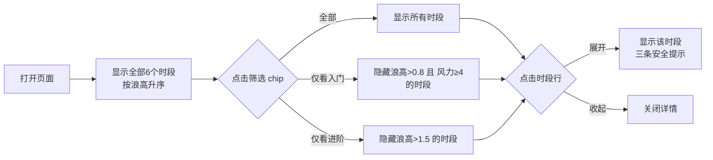

## 1. 产品概述

江面皮划艇俱乐部休息舱浪级适宜推荐屏，帮助学员快速判断今日各时段下水是否合适。

- 面向对象：皮划艇俱乐部学员（入门/进阶两个等级）和教练
- 核心价值：以清晰、直观的方式展示各时段浪况、风力及安全建议，降低下水风险

## 2. 核心功能

### 2.1 用户角色

| 角色 | 说明 | 核心使用场景 |
|------|------|-------------|
| 入门学员 | 刚接触皮划艇，经验不足 | 仅查看适合自己等级的安全时段 |
| 进阶学员 | 有一定经验，可应对更复杂浪况 | 查看适合自己等级的时段 |
| 教练 | 指导学员下水 | 查看所有时段数据，给出建议 |

### 2.2 功能模块

1. **时段列表**：展示今日 6 个时段的浪高、风力、建议等级
2. **等级筛选 chip**：一键切换「仅看我等级」（入门/进阶）
3. **时段详情展开**：点击行查看该时段三条安全提示
4. **浪高警示标红**：浪高 ≥ 1.2m 的行整行红色高亮

### 2.3 页面详情

| 页面名称 | 模块名称 | 功能描述 |
|---------|---------|---------|
| 首页 | 顶部标题区 | 显示俱乐部名称、今日日期、页面标题 |
| 首页 | 筛选 chip 区 | 三个可点击 chip：全部、仅看入门、仅看进阶 |
| 首页 | 时段列表区 | 按浪高升序排列的时段卡片/行列表，每行展示时间段、浪高、风力、建议等级 |
| 首页 | 展开详情区 | 点击行后展开显示该时段三条安全提示文案 |

## 3. 核心流程

用户打开页面 → 默认显示全部时段（按浪高升序） → 点击筛选 chip 过滤等级 → 点击时段行查看安全提示 → 根据推荐决定是否下水

## 4. 用户界面设计

### 4.1 设计风格

- **主色调**：深海蓝 `#0c4a6e` 作为主色，配合水蓝 `#0ea5e9` 作为点缀，体现水上运动主题
- **警示色**：危险红 `#dc2626` 用于浪高 ≥ 1.2m 的行标红
- **按钮样式**：圆角 pill 形 chip，选中状态有深色填充和白色文字
- **字体**：使用思源黑体 / PingFang SC 等现代无衬线中文字体，标题加粗，正文常规
- **布局风格**：卡片式列表，垂直排列，有适当阴影和圆角
- **图标**：使用水波、风向、盾牌等相关 emoji 或 lucide-react 图标

### 4.2 页面设计概览

| 页面名称 | 模块名称 | UI 元素 |
|---------|---------|--------|
| 首页 | 顶部标题区 | 大标题、日期副标题、水波背景装饰 |
| 首页 | 筛选 chip 区 | 三个圆角 chip 横向排列，有选中态动画 |
| 首页 | 时段列表区 | 每行含时间段标签、浪高数值（含单位）、风力等级、建议等级标签；浪高≥1.2m时整行红底白字 |
| 首页 | 展开详情区 | 展开后在该行下方显示带图标序号的三条安全提示，配淡色背景 |

### 4.3 响应式

- 桌面优先设计，适配大显示屏（休息舱竖屏/横屏）
- 同时兼容平板尺寸，最小支持 768px 宽度
- 列表可滚动，chip 区在窄屏下可横向滚动

### 4.4 动效

- chip 切换有平滑的背景色过渡动画
- 行展开/收起有高度过渡动画
- 页面加载有时段列表的渐入动画
- 鼠标悬停行时有轻微上浮和阴影加强效果
