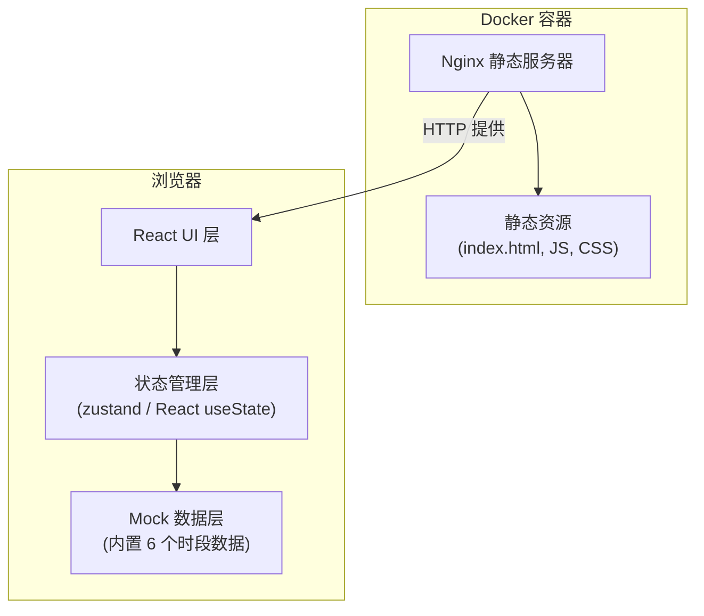

## 1. 架构设计



## 2. 技术说明

- **前端框架**：React 18 + TypeScript 5 + Vite 5
- **样式方案**：Tailwind CSS 3
- **状态管理**：使用 React useState（功能简单，无需引入 zustand）
- **图标库**：lucide-react
- **静态托管**：Nginx（Docker 容器内）
- **容器化**：Docker + Dockerfile 多阶段构建
- **数据**：前端内置 Mock 数据，无后端

## 3. 路由定义

| 路由 | 用途 |
|-----|------|
| `/` | 首页，浪级推荐主界面 |

## 4. 数据模型

### 4.1 数据类型定义

```typescript
type Level = 'beginner' | 'advanced';

interface TimeSlot {
  id: string;
  startTime: string;   // HH:mm
  endTime: string;     // HH:mm
  waveHeight: number;  // 浪高（米），一位小数
  windLevel: number;   // 风力等级（整数）
  suggestedLevel: Level;  // 教练建议等级
  safetyTips: [string, string, string];  // 三条安全提示
}
```

### 4.2 Mock 数据（6 个时段）

内置 6 个时段示例数据，覆盖浪高从 0.4m 到 1.8m，风力从 1 级到 6 级，建议等级包含入门和进阶。

## 5. 前端模块结构

```
src/
├── components/
│   ├── Header.tsx          # 顶部标题区
│   ├── FilterChips.tsx     # 等级筛选 chip 组
│   ├── TimeSlotList.tsx    # 时段列表容器
│   └── TimeSlotItem.tsx    # 单个时段行（含展开详情）
├── data/
│   └── timeSlots.ts        # 内置 6 个时段 mock 数据
├── types/
│   └── index.ts            # TypeScript 类型定义
├── App.tsx                 # 主应用组件
├── main.tsx                # 入口文件
└── index.css               # 全局样式 + Tailwind
```

## 6. 核心逻辑说明

### 6.1 列表排序
- 默认按 `waveHeight` 升序排列，使用 `Array.sort()` 在渲染前处理

### 6.2 等级过滤逻辑
- **全部**：不做过滤，显示所有时段
- **仅看入门**：过滤掉 `waveHeight > 0.8 && windLevel >= 4` 的时段
- **仅看进阶**：过滤掉 `waveHeight > 1.5` 的时段

### 6.3 浪高警示
- 当 `waveHeight >= 1.2` 时，该行添加红色背景和白色文字样式

### 6.4 行展开
- 每个时段行独立维护展开状态（useState），等级过滤、行展开、列表排序三者状态独立互不影响

## 7. Docker 部署

### 7.1 Dockerfile 策略
- 多阶段构建：
  - 阶段 1：使用 node:20-alpine 安装依赖并执行 `npm run build`
  - 阶段 2：使用 nginx:alpine 拷贝 dist 目录到静态资源目录

### 7.2 Nginx 配置
- 单页应用配置：try_files 指向 index.html
- 监听 80 端口
- 开启 gzip 压缩
